##   Hi There, Romi Brooks Here!  
> What do you want to be, It's what do you do, Not what you think. :heartbeat:

&ensp;&ensp;  

  
  
  

- :pig_nose: Wow! What a millennium!?
- :house: Born in a remote village in China.&ensp;
- :four_leaf_clover: Full stack learner.&ensp;
- :wink: Focus on audio development, A music producer.&ensp;
- :walking: Let everyting slow down.&ensp;
- :stuck_out_tongue_winking_eye: Any other entries, Add them when I remember!&ensp; 

### :smiley: About Myself
<a href="https://heyromi.tech/"></a>
<a href="https://x.com/RomiBrooks1"></a>
<a href="[https://www.instagram.com/teen_developer/](https://www.facebook.com/profile.php?id=100087271397689)"></a>

```cpp
class AboutMe {
	public:
    	auto LearningLang() const -> void {
			cout << "CPP\n"
				 << "Go\n"
				 << "Python\n"
				 << "Typescript\n";
		}

		auto SayWhat() const -> void {
			cout << "To go to the sea, to have a \"pure\" love, to the most desolate place, to the most prosperous place"
				 << endl
				 << "Leaving this \"bad\" world without any burden"
				 << endl
				 << "Fuck the world." << endl;
		}
};
```
